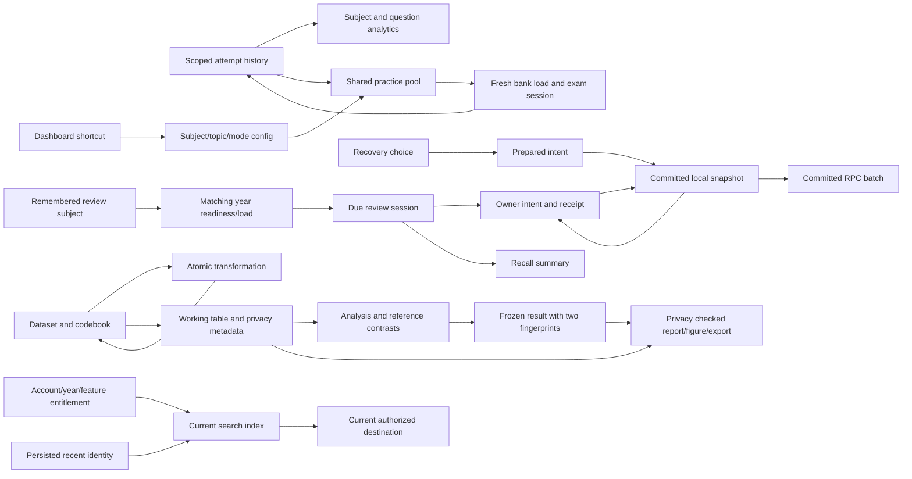

# Connected engineering audit - 2026-10-06

This is a local candidate on `codex/vetmock-loop-1006`, based on `6b454dce`.
Study version 5.137.1 / SW203 and Research 0.1.2 are candidate labels, not production proof.
Primary unrelated edits and all prior lanes remain intact. No new automation,
account deletion, live database change or production deployment was performed.

The owner requested repeated in-chat cycles covering defects, smoother journeys,
connected data, authored design and useful assets/open source. Follow the existing
[coordination protocol](CONTINUOUS-IMPROVEMENT.md); this report records actual edges
and acceptance evidence instead of adding another runtime or status framework.

## Graph and invariants

| Edge | Required invariant | Evidence entrypoint |
| --- | --- | --- |
| History -> analytics -> practice | Explicit subject identity never borrows another subject; fresh history survives foreground loading; scope precedes cap | `tests/unit/learning-identity.test.mjs`, `tests/e2e/learning-identity.spec.js` |
| Dashboard -> config -> exam | Weak/bookmark shortcuts reset old subject/topic; displayed count uses the launch pool | Same learning regressions and real callback/normalizer seam |
| Remembered subject -> review -> summary | Load the subject's actual year; Hard is recalled; failed save never advances | Learning regressions, existing SRS save/scheduling suites |
| Recovery -> prepared intent -> snapshot -> RPC | A rejected choice cannot publish or cancel later; acknowledgements survive unreadable outbox records | `tests/unit/user-data-recovery-commit.test.mjs`, retained-original-v2 runner |
| Transform -> recipe/codebook | One native transaction commits both or neither; typed retry survives failure | `research/tests/unit/store-transform-atomic.test.mjs`, native browser correctness spec |
| Hidden source -> derived column -> export | Replay cannot reset saved hidden/privacy metadata; derived private values stay private | `research/tests/unit/intake-derived-privacy.test.mjs`, native browser export checks |
| Codebook -> OLS -> frozen result | Actual reference controls contrasts; interpretation changes mark frozen results earlier, without rewriting old numbers | Research provenance/OLS regression and saved-report journey |
| Account/entitlement -> search/recent -> destination | Render and dispatch current authorized items, invalidate private source caches | UX/privacy slice evidence pending |

## Candidate repairs

- Learning: compound analytics identity, fresh weak history, scope-before-cap
  counts, Dashboard weak/bookmark destinations, remembered cross-year SR loading,
  Hard summary, valid imported ID0 coverage and retained ISO chronology. Current
  full source has zero cross-subject question-ID collisions; same-ID regression
  fixtures cover historical/schema-valid records rather than asserting current duplicates.
- Durability: commit-gated prepared recovery, canceled-intent suppression and
  receipt/marker retention across failed reads/deletes. Existing RPC protocol and
  explicit legacy recovery/export remain unchanged; no migration was needed.
- Research: atomic derived saves, privacy propagation, OLS reference selection and
  separate codebook interpretation hash. Saved-result/export privacy closure is
  under review. Canonical data hash, numerical reference fixtures and tolerances
  are preserved.
- Search: current-recents and owner/private-source invalidation slice is under
  verification. Final acceptance will record actual results below.

## Assets and open source

The actual landing -> year -> phase -> Home journey was inspected with native
browser accessibility state and a screenshot. Retain its warm editorial surfaces,
Fraunces/Sarabun hierarchy, existing Mochi artwork and line navigation icons.
`21st review src/components/FeatureMenu.jsx --json` reported zero local findings;
that is static evidence, not a full usability guarantee. The menu's old emoji
spans are hidden by CSS, so replacing them would not establish a visible improvement.

- Keep existing NavIcon and already installed [Lucide](https://lucide.dev/license)
  for functional icon gaps; retain ISC/Feather-MIT notices if new icons are used.
  A new icon library or unrelated stock illustration is not justified by this pass.
- [axe-core](https://github.com/dequelabs/axe-core) is a maintained MPL-2.0 candidate
  for deeper automated accessibility checks. No runtime dependency was added;
  first select a concrete missing browser/accessibility invariant.
- Both apps now lock `source-map-js` 1.2.2, the patched version for
  [GHSA-68fv-2mgg-jv7q](https://github.com/advisories/GHSA-68fv-2mgg-jv7q).
  Fresh study audit: high/critical 0, moderate 8, all on the
  Cornerstone -> vtk -> xmlbuilder2 -> js-yaml -> sprintf chain. Research audit: 0.
  No current patched sprintf release was found (registry latest 1.1.3);
  [the advisory](https://github.com/advisories/GHSA-hp3w-g68c-fv3c) remains tracked.
  A major imaging upgrade requires its own render/measurement/DICOM proof.

## Verification checkpoint

- Authoritative stats: 6,731 source / 6,663 learner-ready / 68 held / 94 banks.
  No held answer, source or clinical fact was promoted or rewritten.
- Learning dedicated 14/14; final pool/flow/engine 61/61; earlier adjacent
  suites 84/84 and 49/49. Durability focused 54/54, actual retained-original-v2
  scenarios 2/2. Detailed lane receipts: `work/loop-20261006/{learning,durability,research}.md`.
- PWA unit 30/30 and unchanged native WebKit update lifecycle 5/5 passed.
  The earlier hosted offline-entry failure remains recorded; one bounded local
  pass does not establish its historical root cause. No worker lifecycle repair
  or weakened assertion was made.
- Stable Study data51/51, build and contrast3/3 pass. At the owner's precision
  instruction, the redundant broad local browser sweep was stopped; it is not
  full-gate green. Exact-head hosted CI supplies broad acceptance.
- Changed learning/search native journeys pass20/20 across four profiles,0 retries.
  The first Dashboard failures selected a semester2 subject in semester1; the
  corrected fixture uses a real current subject. Original failures remain recorded.
- Real unprivileged SDK checks17/17 and two-context member/guest UI8/8 pass;
  existing40-row data aggregate is unchanged. UI testing exposed App hiding local
  read/write errors during exams; one parent guard now keeps these errors and retry
  visible; its durable active-exam native regression passes4/4. The first failed UI receipt is retained. Fresh owner cleanup is pending
  after production acceptance; outsider sessions/refresh/account/dependents are cleared.
- Research PR21 passed exact-head Build/Smoke/R parity and merged as c0be16fc.
  Production Research READY deployment dpl_DYrbHsEuJNnfzbCr3Zmt67atYdon has this SHA
  and public aliases. Live changed flows pass16/16,0 retries, headers present4/4;
  exact main CI remains pending at this checkpoint.

## Remaining work and next cycle

Finish Research public acceptance, reconcile Study to fresh main, run the small
exam-notice regression and require exact-head CI before the next release. Verify
public changed flows and clean only the new fixture. Reuse passed evidence;
repeat checks only after relevant changes or an unresolved failure.

Then select the next observed bottleneck or uncovered edge from this graph;
do not infer permanent zero bugs or add a new dependency/asset without a concrete
user benefit. Real Google/LINE/OAuth and physical devices remain untested;
synthetic ordinary accounts and two browser contexts do not establish those claims.
